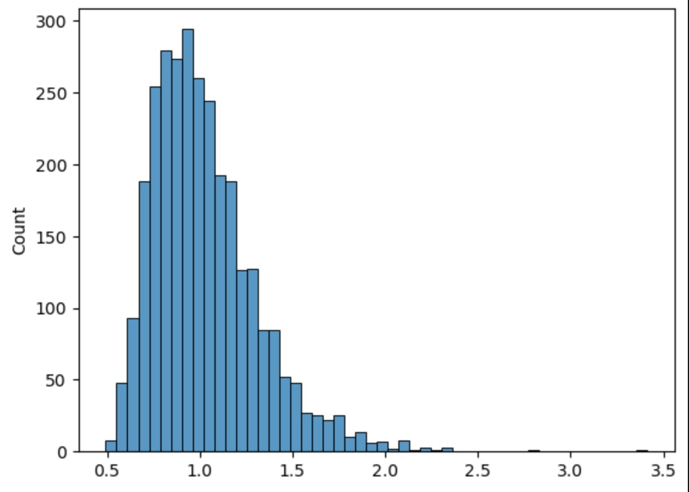
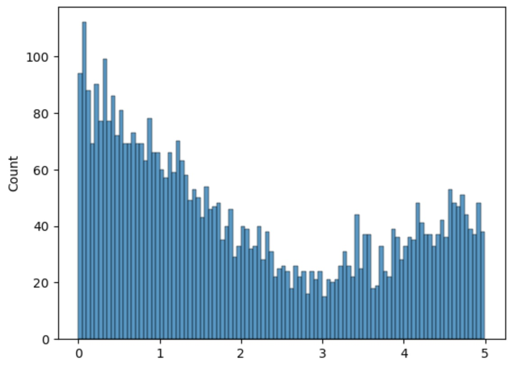

# Symulacja Ruchu Wahadłowego Samochodów

## System

Ruch wahadłowy samochodów na drodze z jednym pasem ruchu, obsługiwany za pomocą sygnalizacji świetlnej. Ruch odbywa się naprzemiennie z obu kierunków.

## Cel

Optymalizacja przepustowości drogi poprzez dobór idealnego czasu dla sygnalizacji świetlnej, minimalizacja średniego czasu oczekiwania pojazdów oraz maksymalizacja płynności ruchu w określonym przedziale czasowym (niski maksymalny czas oczekiwania).

## Hipotezy

1. Wydłużenie czasu trwania zielonego światła przy większym natężeniu ruchu w jednym kierunku poprawi przepustowość drogi, w porównaniu do takiego samego czasu dla A i B.
2. Istnienie czujnika przejazdu samochodu resetującego czas trwania przerwy pomiędzy światłami poprawia średnią przepustowość odcinka. (to zmieniliśmy na inteligentny system świateł)
3. Równomierny podział czasu sygnalizacji przy równym natężeniu ruchu minimalizuje średni czas oczekiwania.

## Wejścia

- Liczba pojazdów przybywających z każdego kierunku w jednostce czasu.
- Początkowe ustawienia czasu trwania zielonego światła.
- Włączenie/wyłączenie czujnika przejazdu auta.

## Zakłócenia

- Nagłe zwiększenie natężenia ruchu w jednym kierunku.
- Opóźnienia spowodowane niedostosowaniem się kierowców do sygnalizacji.
- Zmienny czas przyjazdu pojazdów z obu kierunków.

## Wyjścia

- Średni czas oczekiwania pojazdów w kolejce.
- Maksymalny czas oczekiwania.
- Liczba pojazdów przepuszczonych przez odcinek wahadłowy w określonym czasie (średnia przepustowość).
- Średni czas przejazdu odcinka wahadłowego od chwili zapalenia się zielonego światła.

## Parametry

| KATEGORIA | DETERMINISTYCZNE                                                                                                 | LOSOWE                                                   |
| --------- | ---------------------------------------------------------------------------------------------------------------- | -------------------------------------------------------- |
| ZMIENNE   | Czas trwania zielonego światła A                                                                               | Natężenie ruchu w kierunku A, zmienne wraz z czasem    |
|           | Czas trwania zielonego światła B                                                                               | Natężenie ruchu w kierunku B, zmienne wraz z czasem    |
|           |                                                                                                                  | Czas reakcji kierowców                                  |
| NIEZMIENE | Istnienie czujnika przejazdu samochodu niezależnego od koloru światła (resetuje on czas trwania przerwy) | Procent kierowców z prawem jazdy znalezionym w chipsach |
|           | Czas trwania przerwy pomiędzy zapaleniem świateł                                                              |                                                          |

## Warunki symulacji

- **Czas trwania symulacji**: 1 godzina.

## Wskaźniki oceny

- Średni czas oczekiwania pojazdów.
- Maksymalny czas oczekiwania w kolejce.
- Liczba pojazdów przepuszczonych w ciągu godziny.

# Model Konceptualny

## Rozkłady dla zmiennych losowych

* Natężenia ruchu: czas przyjazdu następnego kierowcy opisany rozkładem wykładniczym.
* Czasy reakcji kierowców: rozkład lognormalny
* Czas wjazdu kierowcy imbecyla: rozkład U-kwadratowy z lewostronną granicą w 0
* Procent kierowców z prawem jazdy znalezionym w chipsach: stały procent np. 1% wszystkich kierowców
r
## Zakłócenie - wjazd na czerwonym

* Każdy z przyjeżdżających kierowców ma stałą szansę bycia niekompetentnym
* Zakładamy, że mimo niekompetencji kierowcy nie wjeżdżają na czołówke z innymi, czyli nie jadą na czerwonym gdy z przeciwnej strony już jadą inne auta
* Jeśli niekompetentny kierowca znajdzie się na 1. miejscu kolejki losowany jest mu czas wjazdu na czerwonym z rozkładu U-kwadratowego. Gdy ten czas będzie zbyt długi i naprzeciwka ruszą pojazdy, to kierowca nie ruszy.
* Przebadane zostaną 2 warianty:
  * Po przejeździe na czerwonym czas trwania przerwy pomiędzy światłami będzie resetowany
  * -||- nie będzie resetowany, "przeciwni" kierowcy stracą część swojego zielonego

## Zależności

* Średni i maksymalny czas oczekiwania zależy od wszystkich parametrów.
* Czas trwania zielonego światła jest zależny od natężenia ruchu danej strony blokady.
* Czas trwania przerwy pomiędzy światłami jest zależny od natężenia ruchu, istnienia czujnika wjazdu na czerwonym i zakłóceń.

# Model matematyczny

- Czas reakcji wykładniczo zwiększa czas oczekiwania
- Czas oczekiwania zwiększa liniowo długość kolejki
- Czas reakcji wpływa liniowo na czas przejazdu
- Czas przejazdu liniowo wpływa na ilość przejechanych samochodów
- Natężenie ruchu wpływa wykładniczo na długość kolejki

# Plan działania

**STAŁE**
- Czas reakcji kierowcy: rozkład lognormalny (średnia: 1, odchylenie standardowe: 0.38) + 0.3

- Timestamp wjazdu na czerwonym świetle, wartości mniejsze od 5 z połączonych rozkładów: 
  - abs(rozkład normalny (średnia: 0, odchylenie standardowe: 1.2, ilość: 3000)), 
  - abs(rozkład normalny (średnia: 4, odchylenie standardowe: 0.75, ilość: 2000)) 
  
  

- Czy kierowca wygrał prawo jazdy w laysach: 2% szansy dla każdego kierowcy

**ZMIENNE**
- Czas przyjazdu następnego kierowcy: rozkład wykładniczy ()